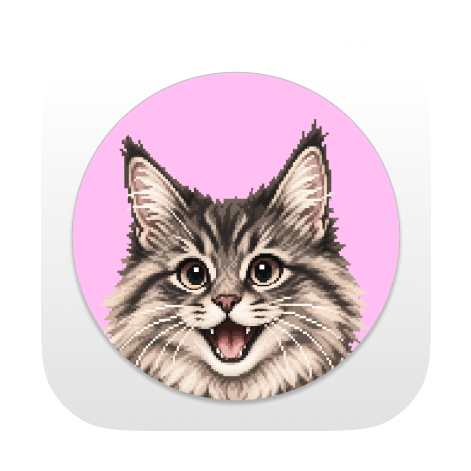
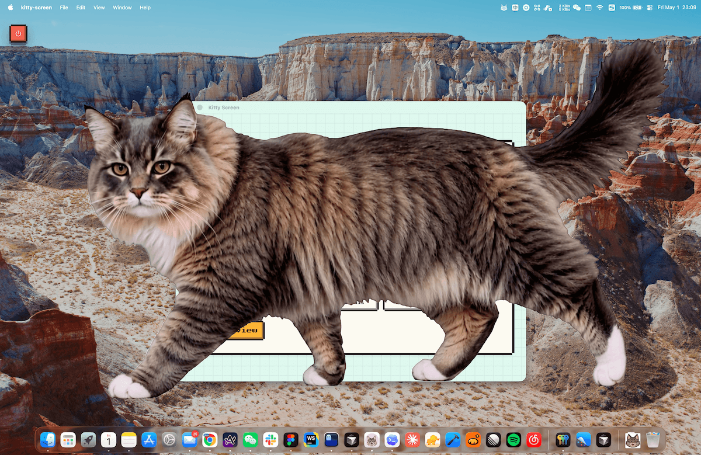

# Kitty Screen

[中文说明](README.zh.md) · [GitHub](https://github.com/elliothux/kitty-screen) · [Download](https://github.com/elliothux/kitty-screen/releases)

Kitty Screen is a Tauri + React screen saver app that displays a cat animation as a screen-blocking overlay. It activates after the screen has stayed on continuously for the configured amount of time, helping interrupt long uninterrupted screen sessions.

The animation asset is produced from green-screen cat footage, then converted into platform-specific transparent video resources for the app.

<p align="center">
  
</p>

## Preview

<p>
  
  
</p>

## Download

Download the latest app build from [GitHub Releases](https://github.com/elliothux/kitty-screen/releases).

## Prompt Templates

Reusable prompts for image and video generation live in [PROMPTS.md](PROMPTS.md).

Use that file when generating a new cat identity or rebuilding the screensaver animation sequence.

## How to Customize Your Own Cat Character

You can replace the default cat with your own cat by rebuilding the animation assets. The app expects a green-screen entrance video and a shorter green-screen loop video, then converts them into transparent platform-specific resources during the build workflow.

The short version is:

1. Prepare reference photos of your cat.
2. Generate ordered green-screen keyframes.
3. Turn those keyframes into two green-screen videos.
4. Convert the videos into transparent macOS and Windows resources.
5. Run the app and tune the chroma key if needed.

### 1. Prepare Reference Photos

Collect clear, high-resolution photos of the cat you want to use. The image model needs enough visual information to keep the same identity across every generated frame.

Recommended photo set:

- A front-facing face close-up.
- Left and right side profiles.
- A full-body standing or walking pose.
- A sitting pose.
- A lying or relaxed pose.
- Close shots that show coat markings, paws, tail, eyes, ear shape, and fur length.

Keep the reference photos focused on one cat. Avoid photos with other animals, busy backgrounds, heavy filters, costumes, or extreme lighting. If your cat has distinctive markings, include at least one photo where those markings are easy to see.

### 2. Generate Green-Screen Keyframes

Use GPT Image or another image model that can follow image references. The goal is to generate a numbered sequence of still frames where your cat follows the same movement as the built-in example.

Use two kinds of references:

- Identity references: your cat photos. These control face, coat color, markings, body shape, fur length, paws, tail, and general appearance.
- Motion references: `assets/raw-furryball/001.png` through `assets/raw-furryball/012.png`. These control pose, camera angle, body placement, and animation timing.

Save the generated frames under a new folder:

```text
assets/raw-<cat-name>/001.png
assets/raw-<cat-name>/002.png
...
assets/raw-<cat-name>/012.png
```

Each frame should use a flat `#00ff00` green-screen background. Keep it clean: no floor, shadows, gradients, props, text, UI, furniture, room background, or extra animals. A perfectly flat green background makes the FFmpeg chroma key step much cleaner.

Use [PROMPTS.md](PROMPTS.md) as the starting prompt. Replace the identity description with details from your cat, but keep the action, framing, and green-screen constraints strict.

### 3. Generate the Entrance and Loop Videos

Use a video generation tool that supports first-frame, last-frame, or ordered keyframe guidance. Upload the numbered keyframes in order and generate a continuous green-screen cat animation.

Recommended settings:

- 16:9 output.
- Locked camera.
- One consistent cat identity across the whole clip.
- Uniform `#00ff00` green-screen background.
- Slow entrance, stop, crouch, and final settled blocking pose.
- No zoom, pan, tilt, tracking shot, room background, props, text, UI, shadows, or second animal.

Export two videos:

```text
assets/kitty.mp4
assets/kitty-loop.mp4
```

`assets/kitty.mp4` is the full entrance animation. It should include the cat moving into position and settling into the final screen-blocking pose.

`assets/kitty-loop.mp4` is a shorter idle loop. It should start from the settled pose and contain only subtle motion, such as breathing, blinking, or a small tail movement. This keeps the screensaver alive without constantly replaying the full entrance.

### 4. Convert the Videos Into App Resources

Install dependencies first if you have not already:

```bash
bun install
```

Then generate the transparent video resources:

```bash
bun run videos
```

This runs [scripts/generate-videos.mjs](scripts/generate-videos.mjs). It reads `assets/kitty.mp4` and `assets/kitty-loop.mp4`, removes the green background with FFmpeg, applies despill, verifies alpha, and writes the platform-specific outputs:

```text
resources/videos/macos/kitty-screen.mov
resources/videos/windows/kitty-screen.webm
```

You can regenerate only one platform when iterating:

```bash
bun run videos -- --platform macos
bun run videos -- --platform windows
```

### 5. Preview and Tune the Result

Run the Tauri app locally:

```bash
bun run app:dev
```

Use the Preview button in the app to check the overlay. Look for these issues:

- Green edges around fur.
- Missing transparent areas.
- Flickering background.
- Cat identity drifting between frames.
- The loop jumping too sharply when it repeats.

If the green background is not keyed cleanly, adjust `keyColor`, `similarity`, `blend`, and the despill constants in [scripts/generate-videos.mjs](scripts/generate-videos.mjs), then run `bun run videos` again. If the cat identity drifts or the pose changes too much, regenerate the keyframes or video before tuning FFmpeg; chroma key settings cannot fix inconsistent source footage.

## Development

Install dependencies:

```bash
bun install
```

Run the web app:

```bash
bun run dev
```

Run the Tauri app:

```bash
bun run app:dev
```

Build:

```bash
bun run build
```
